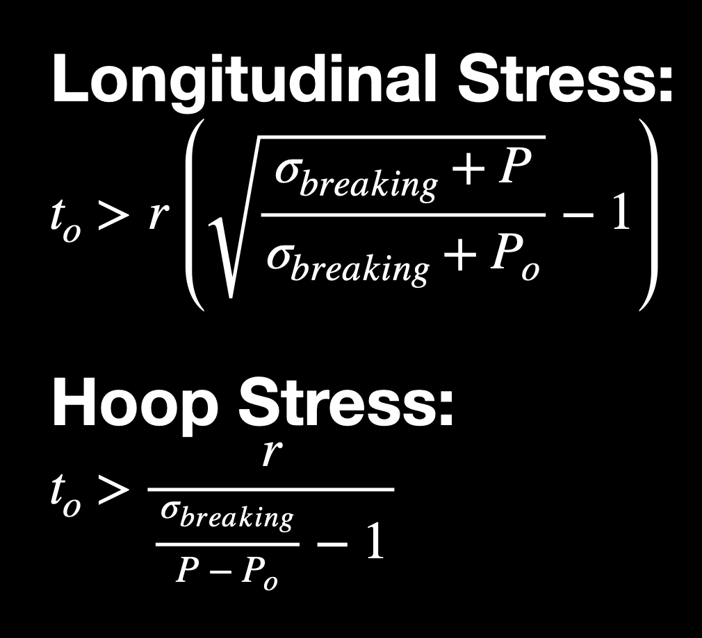
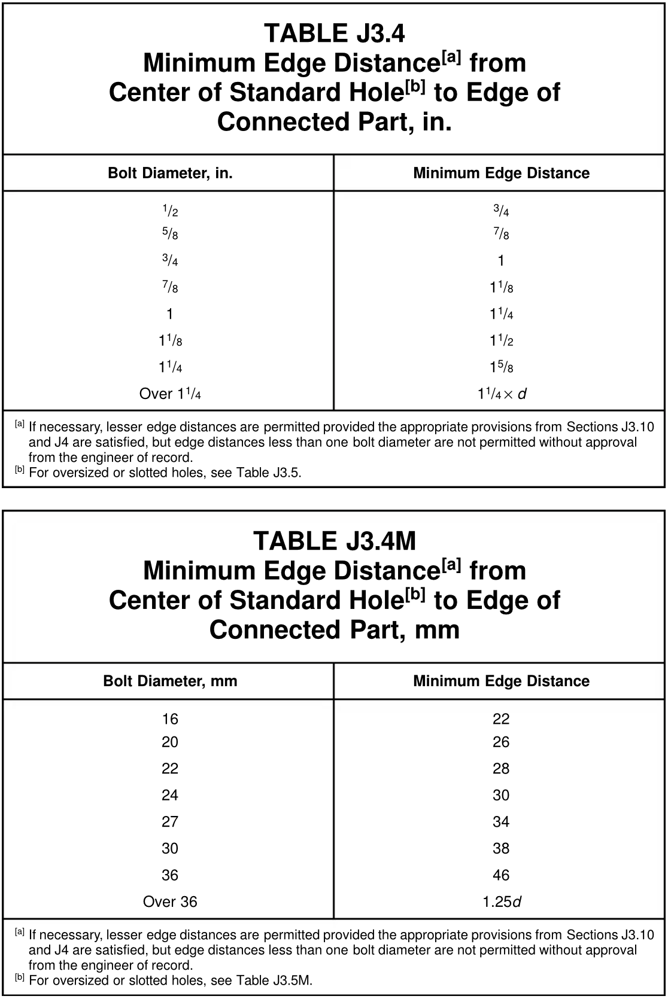

# Solid Rocket Motor Design

Before you begin looking at the code you should know that everything is in SI units(metric system), the only good units in existance. 

The goal of this software is to calculate some crucial parameters for designing a solid rocket motor with the retainers held in place by radial bolts. 

Take input some of the following user's input parameters:
- Peak internal pressure
- Internal Case Diameter
- Case's Yield Strength
- Bolt's Yield Strength
- Bolt profile(Bolt diameter like M5, M4, ...; assuming industry standard thread profile)

And apply the pressure constraints to calculate and return the following design parameters:
- Minimum thickness of the case(for a given safety factor)
- Minimum number of required bolts at each end
- Minimum distance of required bolts from the edge
- Minimum distance of required bolts from the other bolt holes

### Open Motor Design for reference:
The file ProjectRock.ric is the OpenMotor File. It includes critical simulation values including peak K_n, and peak internal Pressure(not the entire simulation data, for that open it in OpenMotor Software and hit `command/ctrl + r`).

- Internal Pressure Simulation:

- The pressure peaks at around 360 psi, which in N/m^2 is $5.516*10^6 N/{m}^2 $. The atmospheric pressure is $1.013*10^5 N/{m}^2$.

# Thickness of the Cylinder:
- This creates stress in longitudinal and hoop direction on the motor which the case has to withstand. In no direction should the stress exceed the material's yield strength(maximum stress in the elastic region).
  - Hoop Stress is nearly twice(exactly two, if neglecting the thickness from calculations) as large as the longitudinal stress in all cylindrical pressure vessels. 
  - 

# Spacing and Number of Screws:
There could be different faliures in screws:
- One of them is when the bolt hole tear out from the edge of material. For not letting that happen it's emperically evident that we should place the bolts at least 1 bolt diameter away from any edge. For some materials this factor could also be 1.5 to 2 dimaters away from the edge.
 
Specifics could be seen in the following source:

# Future of this Software:
### 1. <u>Expanding the predictions to O-rings and thermal liner thickness</u>:
In the later version of this software I would like to add capability to input the simulation data from OpenMotor to for example:
- Perform numerical physics simulaitons using the mass flow rate over time and burn time data to calculate the heat conduction through the thermal liner.
  - including the propogation of charring.
- Allows O-ring parameters to be input and recommend the possible pairs of {O ring thickness, number of such O-rings}. So that the user can choose the locally available O-ring.
  - Then recommend, for a selected choice, the groove dimensions from an some academic sources and standard database on O-rings.

Also, it could be made possible to include other, completely different, design options like: 
- Longitudinal bolts(instead of radial).
- Having a cardboard casting tube between the thermal liner and the case metal.
### 2. <u>Finite Element Analysis(FEA)</u>:
Lastly, a stress tensor could be instantiated for each of the discretized grid points for a selected geometry. Then a load tensor could be defined for each of the points. Each of which could be updated with a numerical analysis from basic mechanics equations to find out any potential faliure points. 
Simple inequality could indicate this condition when for any matrix if the maximum shear exceeds the yield shear strength, and if it exceeds the breaking point then a fracture could be indicated. Once a fracture is created it will propogate predictably.
This condition happens differently at different temperatures and that could be taken into account from the thermal conductivity differential equations. 

This will come handy especially when you have to play with close and riskier margins for better performing rockets, although not recommended!
### 3. <u>A GUI or web app</u>:
Not to mention, a nice Graphic User Interface :)  